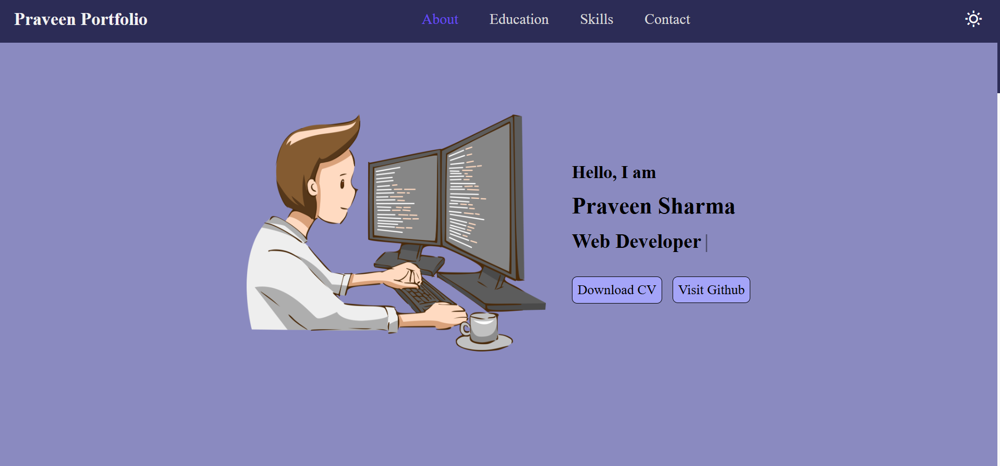
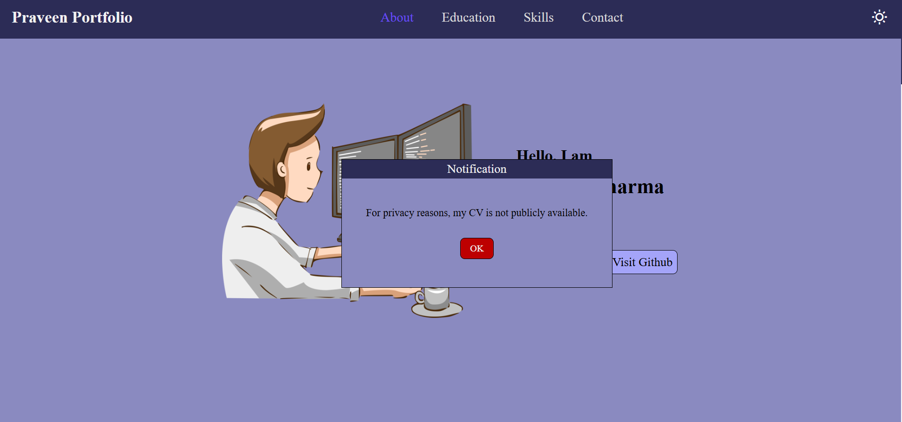
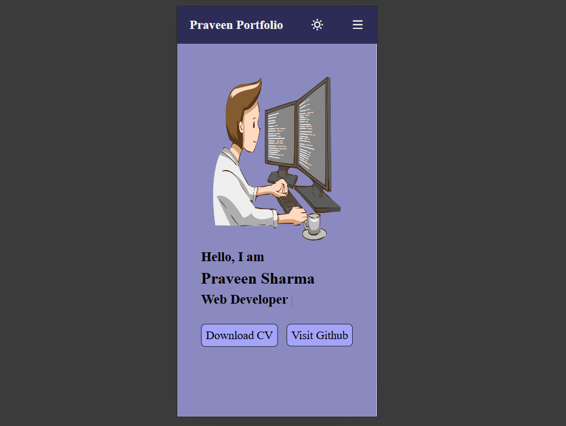

# personal_portfolio_website

## Description
This is my personal portfolio website where I showcase my introduction,education,skills and contact information. it is built using HTML,CSS,JavaScript with a focus on clean design and responsiveness.

## Features
- Smart navigation bar that automatically detects and highlights the active section on page load and while scrolling . Users can also click on any navigation link to jump directly to the corresponding section.
- light/Dark mode toggle that saves user preference in localStorage for consistent experience on page reload.
- Typewriter animation on the About page that dynamically types and deletes profession
- Clickable Github button with hover animation that links to my Github profile.
- Download CV button with hover effect that triggers a notification bar explaining privacy constraints. Users can dismiss the message by clicking the OK button.
- Social media icons in the footer with GitHub ckickable and other icons temporarily disabled.

## Technologies Used
- HTML
- CSS
- JavaScript

## Screenshot

*About page with dynamica nav bar,buttons,some animations,theme btn*

*Download CV button triggers privacy notification*

*Responsive layout for mobile and tablet devices*

## How to Run
1. Clone or download the repository
2. Open 'index.html' in any web browser

## live demo
*check out the live version of my portfolio website*
- [click to view live](https://praveensharma890.github.io/personal_portfolio_website/)

## Author
Praveen Sharma